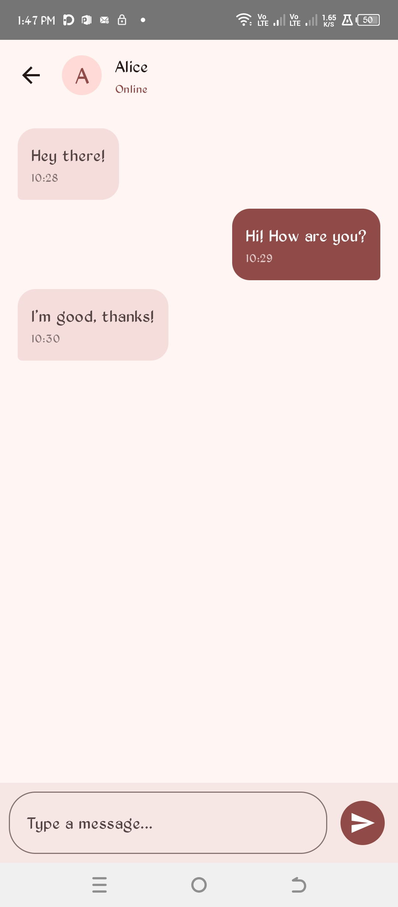
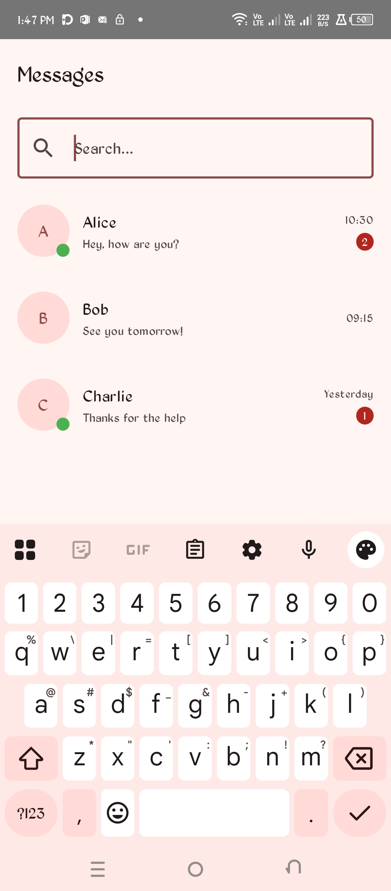

# SimpleMessenger

This is a simple messaging application built with Android.

## Getting Started

To get a local copy up and running, follow these simple steps.

### Prerequisites

*   Android Studio
*   Java Development Kit (JDK)

### Installation

1.  Clone the repo
    ```bash
    git clone git@github.com:Trailblazer-dev/simple-message-app.git
    ```
2.  Open the project in Android Studio.
3.  Build and run the application on an emulator or a physical device.

## Contributing

Contributions are what make the open source community such an amazing place to learn, inspire, and create. Any contributions you make are **greatly appreciated**.

1.  Fork the Project
2.  Create your Feature Branch (`git checkout -b feature/AmazingFeature`)
3.  Commit your Changes (`git commit -m 'Add some AmazingFeature'`)
4.  Push to the Branch (`git push origin feature/AmazingFeature`)
5.  Open a Pull Request

## License

Distributed under the MIT License. See `LICENSE` for more information.

## Contact

Your Name - your_email@example.com

Project Link: [https://github.com/Trailblazer-dev/simple-message-app](https://github.com/Trailblazer-dev/simple-message-app)

## Screenshots

